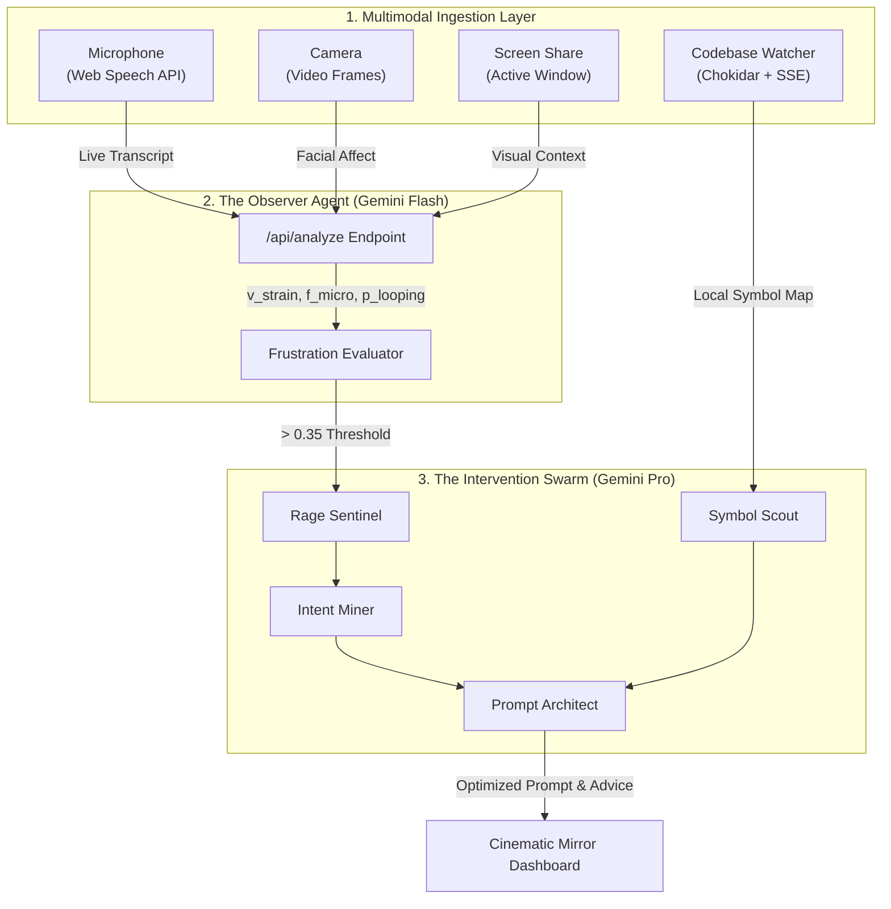

<div align="center">
  

  # Baitrage
  
  **Your Affective Developer Environment Widget**

  [](#)
  [](#)
  [](#)
  [](#)
  [](https://deepmind.google/technologies/gemini/)

</div>

---

We all hit a wall when coding. Error loops, stubborn bugs, and unhelpful AI assistants often push developers to the brink of keyboard-smashing frustration. 

**Baitrage is the intervention.** It's an autonomous affective dashboard that sits in your workflow, tracks your emotional state via content-analysis, and automatically steps in with codebase-aware, cool-headed prompt synthesis before you lose your mind.

## 💡 How It Works

Baitrage operates a localized, privacy-first affective loop:

1. **Monitor**: Uses Gemini Flash to analyze your speech transcription, facial expressions, and screen frames. It looks for genuine signs of frustration (profanity, exasperation), completely ignoring mere high volume.
2. **Ingest**: Continuously watches your active files to build an abstract, up-to-date symbol map of your local project.
3. **Intervene**: When the "circuit breaker" triggers, Baitrage locks your UI briefly to halt the frustration loop.
4. **Synthesize**: It generates a highly optimized, context-aware prompt using Gemini Pro, ready to be pasted directly into your AI coding assistant to get you unstuck.

---

## 🚀 Installation & Usage

Requires Node.js v18+, a modern browser, and a [Gemini API Key](https://aistudio.google.com/apikey).

```bash
# 1. Install dependencies
npm install

# 2. Set up credentials
cp .env.example .env.local
# Add your GOOGLE_GENERATIVE_AI_API_KEY to .env.local

# 3. Start the dashboard
npm run dev
```

### New User Guide

1. **Launch**: Open `http://localhost:3000` in your browser.
2. **Start Monitoring**: Click the power button icon (top left of the screen panel) and grant camera/microphone permissions.
3. **Share Context**: Click the monitor icon to share your IDE or AI chat window.
4. **Code Normally**: As you work, Baitrage indexes your files into its symbol map.
5. **Get Frustrated**: When you run into a bug, just talk out loud. "This stupid function keeps breaking, I've tried three times!"
6. **Pivot**: Baitrage detects your frustration, triggers the circuit breaker, and generates a calm, context-aware prompt.
7. **Copy & Paste**: Click "Copy" on the RESPONSE panel and paste it into your AI assistant.

---

## 🧠 Multi-Agent Architecture

Baitrage is powered by a concurrent, multi-agent architecture designed to separate high-frequency multimodal observation from deep, asynchronous code synthesis. Instead of relying on a single monolithic LLM call, Baitrage delegates tasks to a swarm of specialized agents.



### 1. The Observer Agent (Gemini Flash)
- **Role**: High-frequency multimodal state evaluator.
- **Function**: Every 5 seconds, this fast-inference agent processes an aggregated batch of live transcripts, camera frames, and screen context. Its sole responsibility is **Affective Scoring**. It evaluates the true emotional state based on *content* (e.g., cursing, exasperated phrasing) and *micro-expressions*, actively decoupling frustration detection from raw volume to prevent false positives.

### 2. The Intervention Swarm (Gemini Pro)
When the `Frustration Evaluator` circuit breaker trips (> 0.35 threshold), the concurrent `agent-orchestrator.ts` spawns a swarm of specialized agents to execute the pivot strategy:

1. **Rage Sentinel (Gatekeeper)**: Makes a deterministic local decision on whether to intervene based on the ledger history, preventing intervention spam.
2. **Intent Miner (Analyst)**: Analyzes the transcript and screen grounding to infer the developer's exact current task, blocking issue, and failure mode.
3. **Symbol Scout (Context Fetcher)**: A Retrieval-Augmented Generation (RAG) agent that parses the local `symbol-map.json` (built via Chokidar) to pull only the relevant function signatures, types, and variables needed to solve the issue.
4. **Prompt Architect (Synthesizer)**: The final heavy-lifter. It combines the Intent Miner's task analysis with the Symbol Scout's codebase context to engineer a highly structured, cool-headed "Optimized Prompt". This prompt is designed to be pasted directly into the developer's IDE or AI coding assistant to break the error loop.

<div align="center">
  <br />
  <i>Empowering developers to step back, breathe, and let the codebase solve the problem.</i>
</div>
